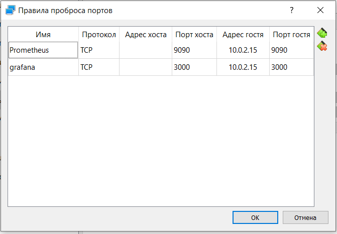
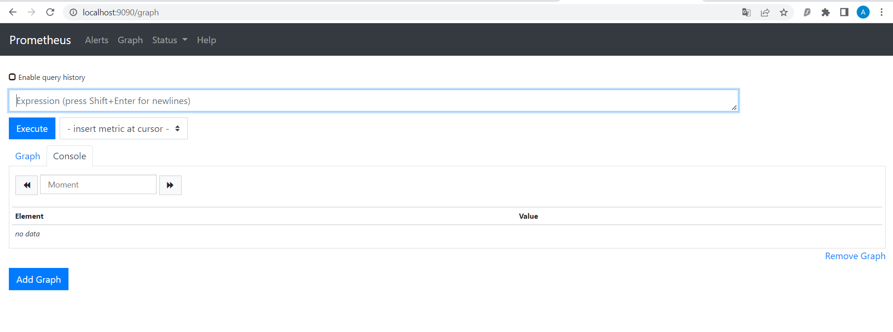
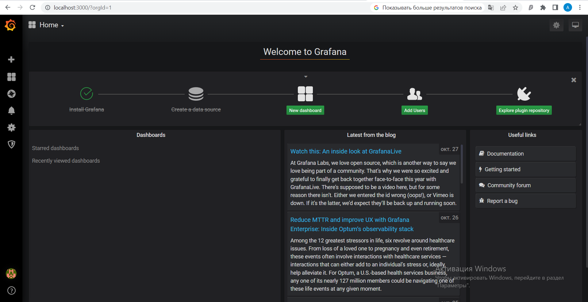
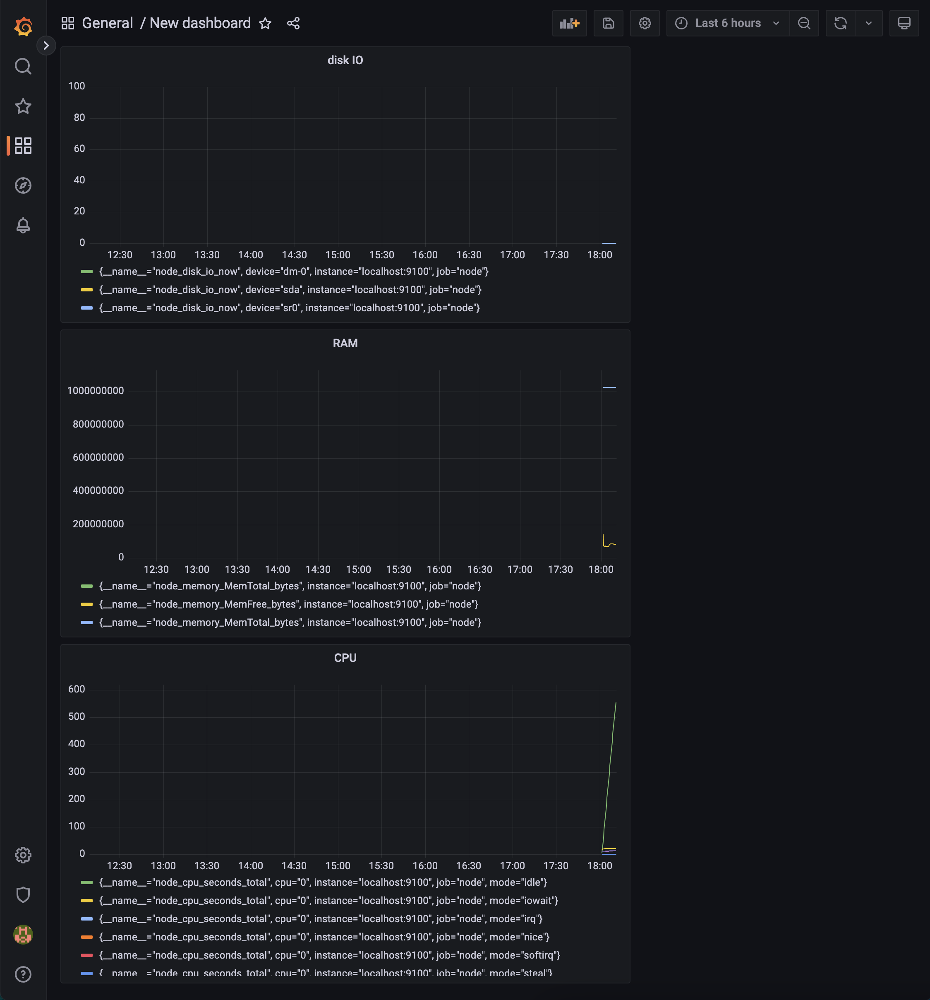
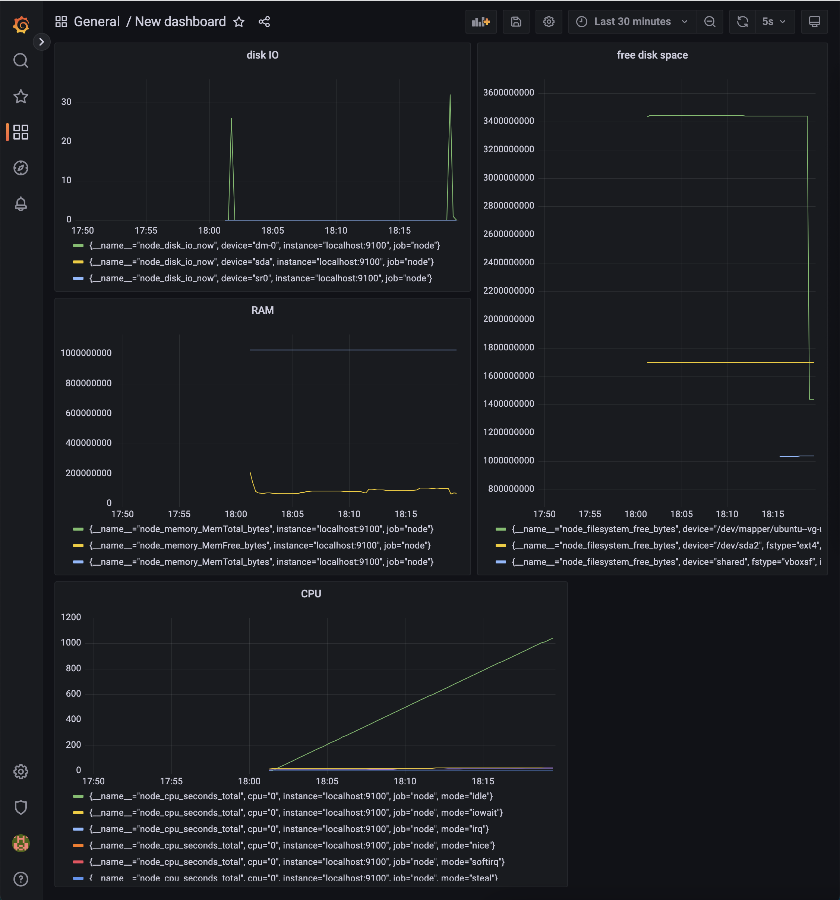
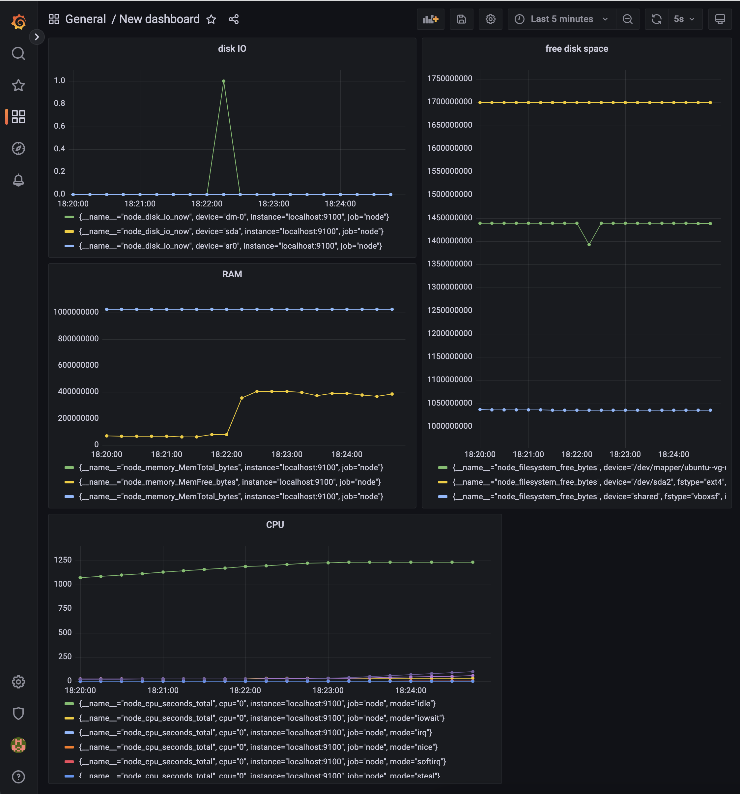

# Prometheus и Grafana

# Установить и настроить Prometheus и Grafana на виртуальную машину. Получить доступ к веб интерфейсам Prometheus и Grafana с локальной машины

- `sudo apt install prometheus`
- `sudo apt install grafana`

Запускаем prometheus со стандартным конфигом (/etc/prometheus/) \
Затем запускаем grafana командой `sudo systemctl start grafana-server`
Далее пробрасываем порты, на котором работают prometheus и grafana (3000, 9090) на основную машину:

Теперь мы можем заходить на prometheus:

На локальной машине заходим по адресу localhost:3000
Открывается веб интверфейс графаны:

кликаем на шестеренку внизу и выбираем пункт data sources \
в открывшемся меню выбираем prometheus и далее прописываем URL http://localhost:9090

Теперь мы можем создать свой дашборд с нужными метриками

График после выполнения скрипта:

График после выполнения команды stress -c 2 -i 1 -m 1 --vm-bytes 32M -t 10s

