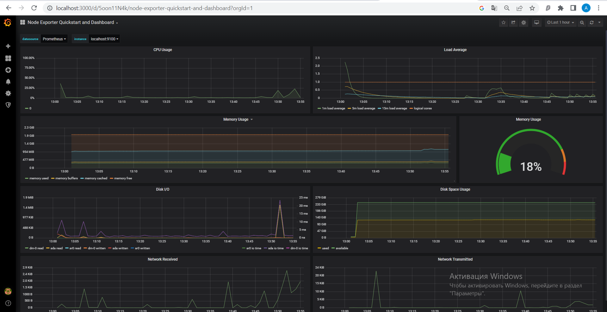

# Готовый дашборд

Здесь нам необходимо зайти в библиотеку дашбордов на сайте графаны и найти там Node Exporter Quickstart and Dashboard

копируем id этого дашборда и импортируем его через настройки графаны - получаем готовый дашборд

График после выполнения скрипта:

График после выполнения команды stress -c 2 -i 1 -m 1 --vm-bytes 32M -t 10s

График после iperf3 с машиной в той же сети:

